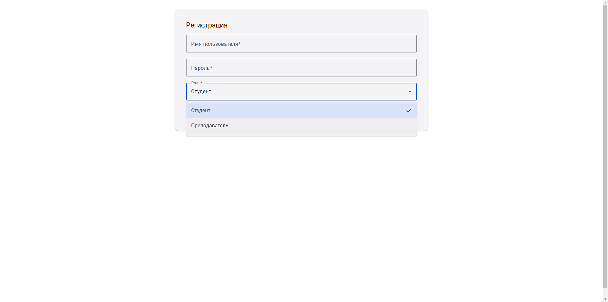
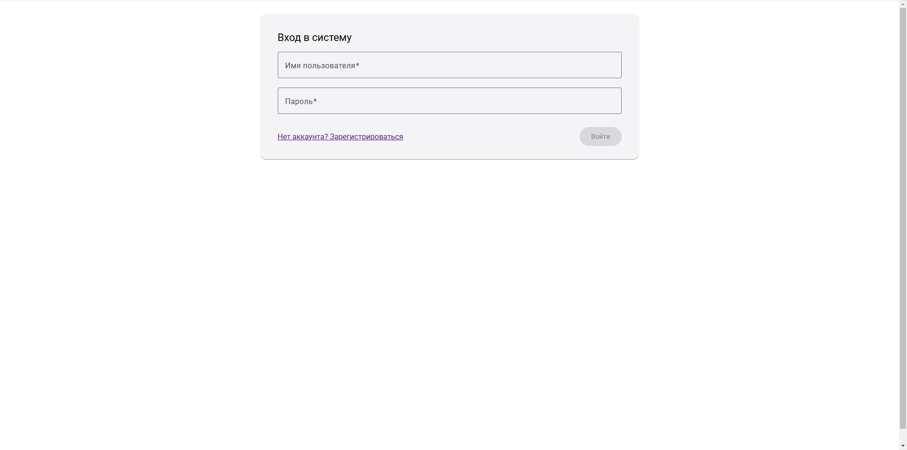
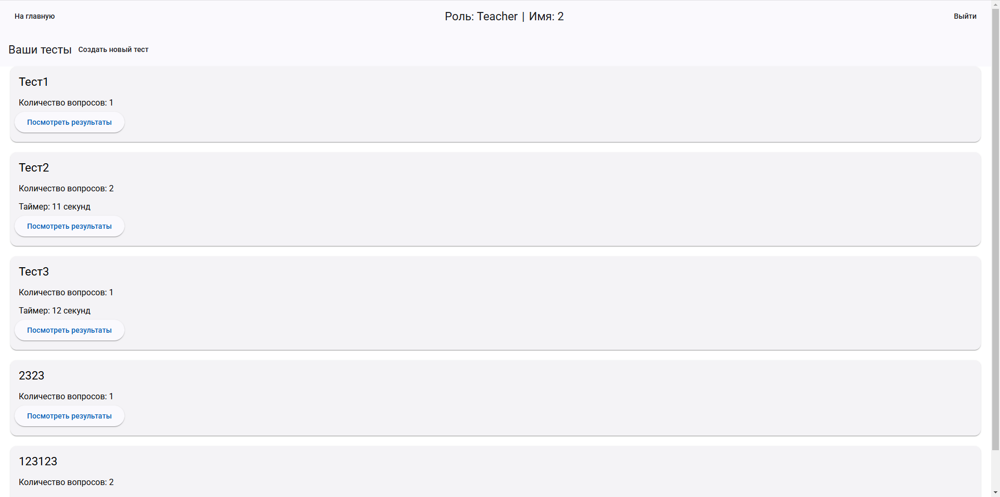
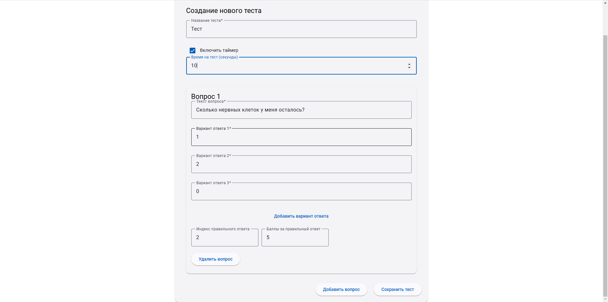
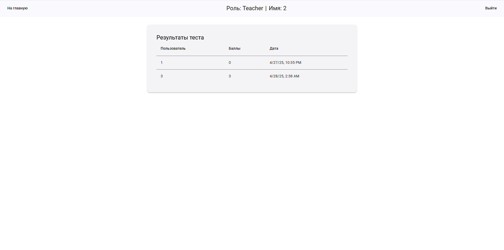
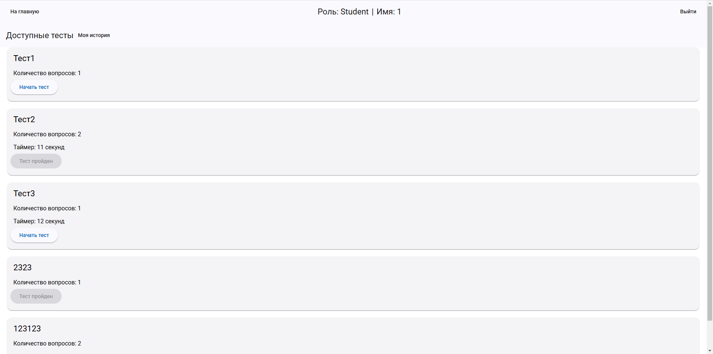
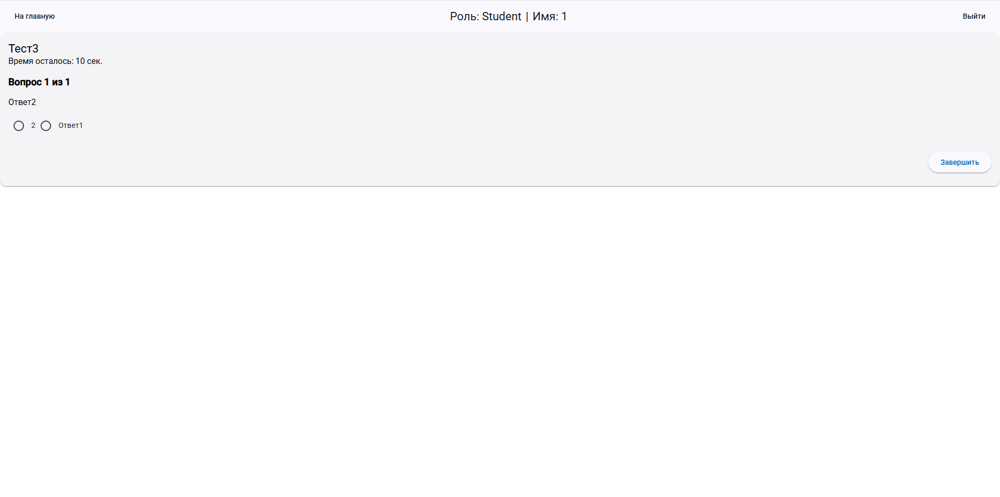
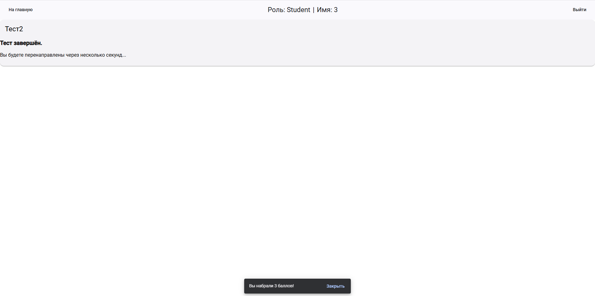
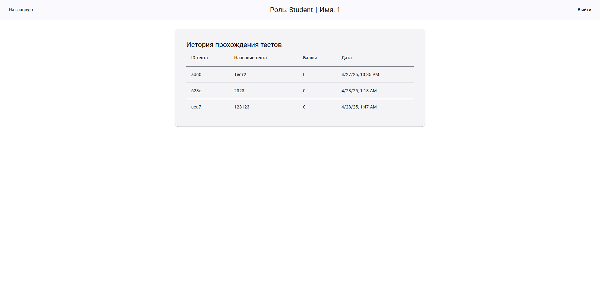

# Система тестирования студентов на Angular

## Цель проекта
Разработка учебного веб-приложения на Angular для создания, прохождения и оценки тестов.
Проект направлен на освоение работы с компонентами, сервисами, роутингом, формами, HTTP-запросами и взаимодействием с Mock API.

## Функциональность

### Для преподавателей (авторов тестов)
Регистрация и вход в систему с ролью "teacher".

Создание новых тестов:
- Ввод названия теста.
- Добавление вопросов типа "одиночный выбор" с вариантами ответов.
- Указание правильного ответа.
- Настройка таймера на выполнение теста (опционально).

Просмотр списка созданных тестов.

Просмотр результатов тестирования студентов по каждому тесту:
- Имя студента.
- Набранные баллы.
- Дата прохождения теста.

### Для студентов
Регистрация и вход в систему с ролью "student".

Просмотр списка доступных тестов.

Прохождение теста:
- Ввод имени студента.
- Последовательное отображение вопросов с вариантами ответов.
- Поддержка таймера (если задан преподавателем).

Завершение теста с выводом итогового количества правильных ответов.

Сохранение результата тестирования.

Просмотр истории своих попыток прохождения тестов.

## Технологический стек

### Frontend
- Angular 17+ (Standalone Components)
- Angular Material (для стилизации)
- RxJS (обработка асинхронных запросов)

### Backend
- JSON Server (server-json) для имитации API (/api/users, /api/tests, /api/results)

### Инструменты разработки
- Git (контроль версий)
- ESLint, Prettier (стандартизация кода)

## Структура действий пользователя

### Регистрация
- Страница /register
- Заполнить имя пользователя, пароль, выбрать роль (teacher или student).
- После успешной регистрации — переход на страницу авторизации.
- 

### Авторизация
- Страница /login
- Ввод логина и пароля.
- В зависимости от роли пользователя — редирект на /teacher или /student.
- 

### Для учителя
- /teacher — панель учителя:
  - Список созданных тестов.
  - Кнопка для создания нового теста.
  - 
- /teacher/create — создание теста:
  - Форма с добавлением вопросов, вариантов ответов и баллов.
  - Возможность включить таймер.
  - 
- /teacher/results/:id — просмотр результатов по тесту:
  - Таблица студентов и их результатов.
  - 

### Для студента
- /student — панель студента:
  - Список доступных тестов.
  - 
- /student/take/:id — прохождение теста:
  - Отображение вопросов и вариантов ответов.
  - Отправка ответов на сервер.
  - 
  - Завершение теста по кнопке завершить или по истечению таймера. 
  - После завершения пройти тест заново нельзя
  - 
- /student/history — история прохождения тестов:
  - Просмотр прошлых результатов.
  - 

## Реализованное в проекте
- SPA-приложение на Angular с роутингом и защитой маршрутов.
- Реактивные формы с валидацией.
- Работа с мок-API через HttpClient.
- Хранение пользователей, тестов и результатов через JSON Server.
- Аутентификация и авторизация пользователей.
- Состояние текущего пользователя сохраняется через localStorage.
- Логика отображения контента в зависимости от роли пользователя.
- Защита маршрутов через AuthGuard и RoleGuard.
- Использование Angular Material компонентов (mat-card, mat-form-field, mat-toolbar, mat-button, mat-input, и другие).

## Запуск проекта

Установить зависимости:

```bash
npm install
```

Запустить Angular-приложение:

```bash
ng serve
```

Запустить JSON Server для имитации API:

```bash
npm install -g json-server
json-server --watch db.json --port 3000
```

Пример db.json для старта:

```json
{
  "users": [],
  "tests": [],
  "results": []
}
```
